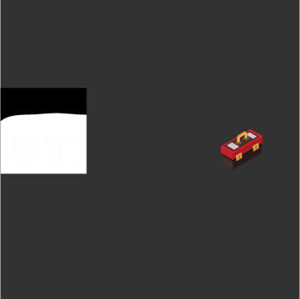

<div align="center">
  <h1>
    <a href="https://github.com/LucasJoel1/UtilityBot" target="_blank">
      
    </a>
  </h1>
</div>

**Utility Bot** is an easy to use utility discord bot with basic moderation features and user friendly information commands.


## Installation

Utility Bot uses [node.js](https://nodejs.org/en/) and the [Discord.js](https://discord.js.org) library and some others.  To use the bot please use the commands below.

```bash
npm init
npm install discord.js
npm install fs
npm i node-fetch
```


## Commands

### API Commands

> - **cat:** Gets a random Picture of a cat <br />
> - **covid:** Get COVID-19 information about a country <br />
> - **dog:** Gets a random Picture of a dog <br />
> - **short:** Shorten a URL <br />
> - **weather:** Get weather info about a city. Powered By [OpenWeatherMap](https://openweathermap.org/) <br />

### Moderation Commands

> - **ban:** Bans a user from a Discord server <br />
> - **kick:** Kicks a user from a Discord server <br />
> - **unban:** Unbans a user from a Discord server <br />

### Utility Commands

> - **ping:** Gets the bots latency to the server and Discord API <br />


## Plans for the Future

> - I plan on adding a help command to the bot <br />
> - I plan on adding a [Minecraft](https://minecraft.net) command to view information about servers and players <br />
> - I plan on adding a github wiki to better explain how to use all the commands <br />
> - I plan on adding FRC functionality which will incude information about teams, events and districts


## How Can I Support Development?

If you have an idea for the bot, have found a bug or need help, please open a issue, I am always open to ideas and am here to help.


